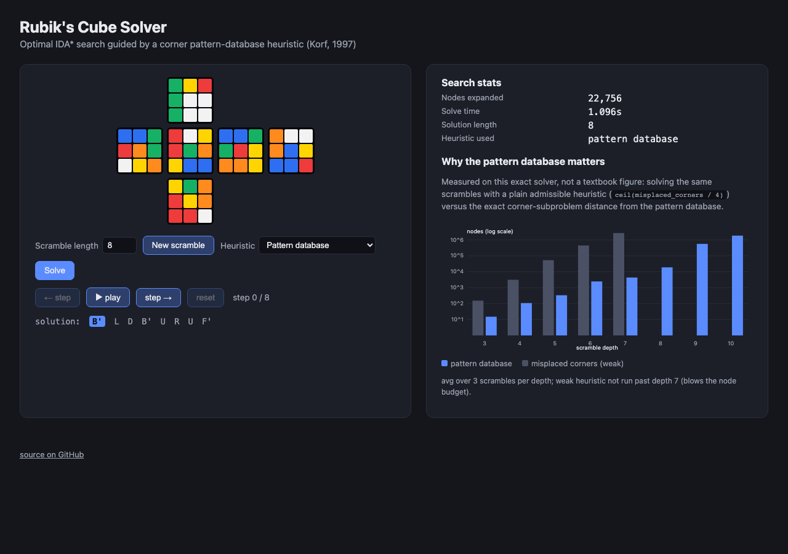

# Rubik's Cube Solver — IDA* with a Pattern Database Heuristic

[](https://github.com/Vipluv01/rubiks-cube-solver/actions/workflows/tests.yml)

An **optimal** Rubik's cube solver: given a scramble, it doesn't just find
*a* solution, it finds the *shortest* one, using Korf's 1997 approach —
Iterative Deepening A* (IDA*) guided by a pattern database (PDB) heuristic.

The interesting part isn't the cube. It's the search: a plain depth-first
search over the cube's ~4.3×10¹⁹-state space is hopeless, and even a
textbook admissible heuristic barely helps. A pattern database — the exact
solve-distance of a *relaxed* subproblem, precomputed once and looked up in
O(1) — changes that completely. This project builds one from scratch and
measures the effect directly: **up to 623x fewer nodes explored** for the
same scrambles (see [Results](#results) below).

## Scope: single (corner) pattern database, not full 3-PDB Korf

Korf's original solver uses *three* pattern databases (corners + two
6-edge groups, ~150–200MB total) and solves any scramble in well under a
second. Building all three correctly — three separate 40+ million/80+
million-state BFS constructions, each with its own bit-packed coordinate
system — is realistically a multi-day undertaking; several independent
"build your own optimal cube solver" writeups took their authors weeks.

This project deliberately scopes down to **one** pattern database (the
corners, 88,179,840 states) and is honest about the cost: solve times grow
from milliseconds (short scrambles) into seconds-to-tens-of-seconds as
scramble depth approaches ~10-11 moves, because the heuristic has no direct
information about edges. The [Results](#results) table shows exactly where
that shows up, and that's the point — it's a working demonstration of
*why* Korf needed all three databases, not just an assertion of it.

## How correctness was verified

Rubik's cube move logic is exactly the kind of code that can look right and
be subtly wrong (a single sign error in an orientation table produces a
"cube" that scrambles and solves internally consistently but isn't the real
44-quintillion-state group). Rather than hand-transcribe move tables from
memory or a reference implementation, `cube.py` **simulates** each of the 6
face turns as a genuine 3D rotation matrix acting on cubie coordinates, and
derives permutation + orientation effects from that simulation (see the
module docstring for the geometric derivation, including the
"checkerboard chirality" subtlety in corner orientation that a naive
same-matrix-for-every-corner decode gets wrong — caught by exactly the
tests below).

This is then checked, not assumed:

- **Group-closure test** (the decisive one): the corner-only subproblem
  (permutation × orientation of the 8 corners, ignoring edges) has an
  exact, known size — `8! × 3⁷ = 88,179,840`. Building the pattern database
  *is* a breadth-first closure of this space, and `scripts/build_pdb.py`
  fails loudly if it closes at any other number. It closes at exactly
  88,179,840, at exactly the known max depth (11) — see the build log
  below. A sign error anywhere in the move geometry would make this either
  not close at all or close at the wrong count.
- **Invariant checks** after long random move sequences (`tests/test_cube.py`):
  corner-orientation sum ≡ 0 (mod 3), edge-orientation sum ≡ 0 (mod 2),
  corner-permutation parity = edge-permutation parity — the necessary
  conditions for any state reachable by legal turns.
- **Order checks**: every quarter turn has order 4; `(R U R' U')` — a very
  well known sequence — has order 6.
- **Round-trip checks**: scramble then apply the exact inverse sequence →
  solved.
- **Solver correctness**: every solution IDA* returns is independently
  replayed against the scrambled cube and checked to actually reach the
  solved state (`tests/test_solver.py`, and again live in
  `scripts/benchmark.py`) — the search isn't trusted just because it
  terminated.

```
$ .venv/bin/python scripts/build_pdb.py
  depth  1: +       18 states  total          19 / 88,179,840
  depth  2: +      243 states  total         262 / 88,179,840
  ...
  depth 10: +15,139,616 states  total  88,115,104 / 88,179,840
  depth 11: +   64,736 states  total  88,179,840 / 88,179,840
saved results/corner_pdb.npy  (88.2 MB)
max depth in database: 11
```

## Architecture

```
rubiks_solver/
  cube.py     cubie-level state (corner/edge permutation + orientation) and
              move application, derived from first-principles 3D rotation
              simulation rather than hand-transcribed tables
  coords.py   corner state <-> integer coordinate in [0, 88,179,840),
              via Lehmer-code permutation ranking + base-3 orientation
  pdb.py      builds the corner pattern database: a vectorized (numpy,
              whole-frontier-at-once) breadth-first search -- this is what
              makes an 88-million-state BFS take ~3 minutes, not hours
  solver.py   IDA* with two swappable heuristics (misplaced-corners
              baseline, and the PDB); the search itself runs on plain
              Python tuples, not numpy, since numpy's per-call overhead on
              8/12-element arrays dominates at IDA*'s node-per-node scale
  scramble.py random scramble generation
  cli.py      command-line entry point
  facelets.py sticker-level model for the web UI, coded independently from
              cube.py's cubie model (not derived from it) as a genuine
              cross-check -- see tests/test_facelets.py
  webapp.py   FastAPI backend for the browser demo: runs the real solver
              server-side and serves static/
  static/     the browser frontend (vanilla HTML/CSS/JS, no framework)
scripts/
  build_pdb.py   builds and saves the pattern database (~3 min, run once)
  benchmark.py   the weak-vs-PDB ablation in Results below
tests/           pytest suite (cube geometry, coordinate round-trips, solver)
```

## Web demo



Scramble, solve, and step through the solution move-by-move on a live
cube net, with the search stats and the weak-vs-PDB chart from
[Results](#results) rendered from the same `results/benchmark.json`. The
backend runs the actual IDA* solver against the actual PDB file — nothing
in this UI is precomputed or faked.

```bash
.venv/bin/python -m uvicorn rubiks_solver.webapp:app --reload
# then open http://127.0.0.1:8000
```

**Deploying it:** `Dockerfile` + `render.yaml` are set up for a one-click
[Render](https://render.com) Blueprint deploy — the pattern database is
committed to the repo (88MB, under GitHub's 100MB limit) rather than
rebuilt on the free-tier build machine, since that BFS peaks at well over
the free tier's memory budget. On Render → New → Blueprint → point at this
repo → deploy. Free-tier services spin down after 15 minutes idle, so the
first request after a quiet period takes ~30-60s to wake up.

## Running it

```bash
uv venv .venv && uv pip install --python .venv/bin/python -r requirements.txt

.venv/bin/python -m pytest tests/ -q                    # fast tests (~0.3s)
.venv/bin/python scripts/build_pdb.py                    # ~3 min, one-time
.venv/bin/python -m rubiks_solver.cli --random 8          # solve a random 8-move scramble
.venv/bin/python -m rubiks_solver.cli --scramble "R U R' U' F2 D"
.venv/bin/python scripts/benchmark.py                     # regenerate Results below
```

## Results

Each scramble is solved **optimally** (shortest possible solution, proven
by IDA*'s exhaustive-with-pruning search) both with the corner PDB and with
a plain admissible baseline (`ceil(misplaced_corners / 4)` — a single face
turn can fix at most 4 corners, so this never overestimates). 3 random
scrambles per depth; nodes and time are averaged over the attempted runs.

| depth | weak: avg nodes | weak: avg time | PDB: avg nodes | PDB: avg time | speedup (nodes) |
|---|---|---|---|---|---|
| 3 | 153 | 0.00s | 15 | 0.00s | 10x |
| 4 | 3,165 | 0.01s | 108 | 0.00s | 29x |
| 5 | 53,648 | 0.15s | 335 | 0.00s | 160x |
| 6 | 453,542 | 1.55s | 2,475 | 0.01s | 183x |
| 7 | 2,722,446* | 12.16s | 4,371 | 0.05s | 623x |
| 8 | not run | — | 19,084 | 0.17s | — |
| 9 | not run | — | 568,361 | 3.73s | — |
| 10 | not run | — | 1,881,244 | 11.85s | — |

\* the weak heuristic did not solve all 3 seeds within its 6M-node budget
at depth 7 — the gap keeps widening past this point; it wasn't run at all
beyond depth 7. Machine: Apple Silicon, single-threaded CPython (no PyPy/JIT).

Two things worth reading off this table:

1. **The speedup itself grows with depth** (10x → 183x → 623x+), because
   the search tree the weak heuristic has to explore grows exponentially
   in depth while the PDB, being an *exact* distance rather than a coarse
   bound, keeps pruning branches early. This is the whole argument for
   pattern databases over ad hoc admissible heuristics.
2. **Even the PDB heuristic's cost grows quickly past depth ~9** (19K →
   568K → 1.9M nodes, depths 8→9→10) — visible, measured evidence for why
   the full solver needs edge information too. A single corner PDB is
   blind to edges entirely, so once corners are cheap to fix, most of the
   remaining search burns nodes on edge permutations it has zero
   information about. This is exactly the gap the second and third pattern
   databases in full Korf close.

## What a full implementation would add

- Two more pattern databases, over two disjoint 6-edge subsets (~42.5M
  states each), combined via `max(corner_pdb, edge_pdb_1, edge_pdb_2)` —
  the standard Korf construction, giving sub-second optimal solves at any
  depth up to God's Number (20).
- A bit-packed (not Lehmer-code) coordinate representation for faster
  hashing at that scale.
- A two-phase (Kociemba-style) *near*-optimal mode as a fast fallback when
  optimality isn't required.
